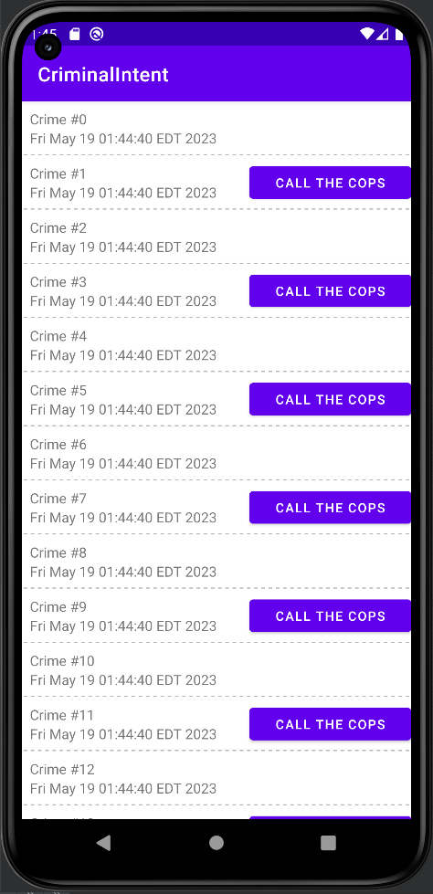

МИНИСТЕРСТВО НАУКИ И ВЫСШЕГО ОБРАЗОВАНИЯ
РОССИЙСКОЙ ФЕДЕРАЦИИ
ФЕДЕРАЛЬНОЕ ГОСУДАРСТВЕННОЕ БЮДЖЕТНОЕ
ОБРАЗОВАТЕЛЬНОЕ УЧРЕЖДЕНИЕ ВЫСШЕГО ОБРАЗОВАНИЯ
«САХАЛИНСКИЙ ГОСУДАРСТВЕННЫЙ УНИВЕРСИТЕТ»

      

Институт естественных наук и техносферной безопасности Кафедра информатики Чагочкин Никита

   

Лабораторная работа №8.1 «Вывод списков и RecyclerView» 01.03.02 Прикладная математика и информатика

            

Научный руководитель 
Соболев Евгений Игоревич

   

г. Южно-Сахалинск 2023 г.

***
# 
Типы View в RecyclerView

Для этого сложного упражнения вам нужно будет создать два типа строк в вашем RecyclerView: для обычных и для более серьезных преступлений. Чтобы это реализовать, вы будете работать с функцией в RecyclerView.Adapter. Присвойте новое свойство requiresPolice объекту Crime и используйте его, чтобы определить, какой тип View загружен в CrimeAdapter, путем реализации функции getItemViewType(Int) (developer.android.com/reference/android/support/v7/widget/RecyclerView.Adapter.html#getItemViewType). В функции onCreateViewHolder(ViewGroup, Int) вам также необходимо добавить логику, которая возвращает различные ViewHolder в зависимости от ViewType, возвращаемого функцией getItemViewType(Int). Используйте оригинальный макет для преступлений, которые не требуют вмешательства полиции, и новый макет с усовершенствованным интерфейсом, содержащий кнопку с надписью «Связаться с полицией» для серьезных преступлений.
***
# 
Решение 

## 
Присвоил новое свойство requiresPolice объекту Crime 

        data class Crime(val id: UUID = UUID.randomUUID(),
                        var title: String = "",
                        var date: Date = Date(),
                        var isSolved: Boolean = false,
                        var requiresPolice:Boolean=false)

## 
Реализовал функцию getItemViewType(Int) в функции onCreateViewHolder
 

        override fun getItemViewType(position: Int): Int {
            var crime=crimes[position]
            return if(crime.requiresPolice){
                1
            }else 0
        }

## 
В функции onCreateViewHolder добавил логику, которая возвращает различные ViewHolder в зависимости от ViewType, возвращаемого функцией getItemViewType(Int).
 

        return if(viewType==1){
                var view = layoutInflater.inflate(R.layout.list_item_crime_police, parent, false)
                CrimeHolder(view)
            }else {
                var view = layoutInflater.inflate(R.layout.list_item_crime, parent, false)
                CrimeHolder(view)
            }

## 
В файле CrimeListViewModel.kt добавил определение поля requiresPolice
 

        class CrimeListViewModel : ViewModel() {
            val crimes = mutableListOf<Crime>()
            init {
                for (i in 0 until 100) {
                    val crime = Crime()
                    crime.title = "Crime #$i"
                    crime.isSolved = i % 2 == 0
                    crime.requiresPolice=i%2!=0
                    crimes += crime
                }
            }
        }

## 
Добавил новый макет с усовершенствованным интерфейсом, содержащий кнопку с надписью «Связаться с полицией» для серьезных преступлений.
 

        <?xml version="1.0" encoding="utf-8"?>
        <LinearLayout xmlns:android="http://schemas.android.com/apk/res/android"
            xmlns:tools="http://schemas.android.com/tools"
            android:orientation="horizontal"
            android:layout_width="match_parent"
            android:layout_height="wrap_content"
            android:background="@drawable/dotted_border">
            <LinearLayout xmlns:android="http://schemas.android.com/apk/res/android"
                android:orientation="vertical"
                android:layout_width="match_parent"
                android:layout_height="wrap_content"
                android:padding="8dp"
                android:layout_weight="2">
                <TextView
                    android:id="@+id/crime_title"
                    android:layout_width="match_parent"
                    android:layout_height="wrap_content"
                    android:text="Crime Title"/>
                <TextView
                    android:id="@+id/crime_date"
                    android:layout_width="match_parent"
                    android:layout_height="wrap_content"
                    android:text="Crime Date"/>
            </LinearLayout>

            <Button
                android:id="@+id/call_the_cops"
                android:layout_width="match_parent"
                android:layout_height="match_parent"
                android:layout_marginTop="5dp"
                android:layout_marginBottom="5dp"
                android:layout_weight="2.8"
                android:text="call the cops"
                android:textSize="13dp"
                tools:ignore="TextSizeCheck,TouchTargetSizeCheck">

            </Button>
        </LinearLayout>

